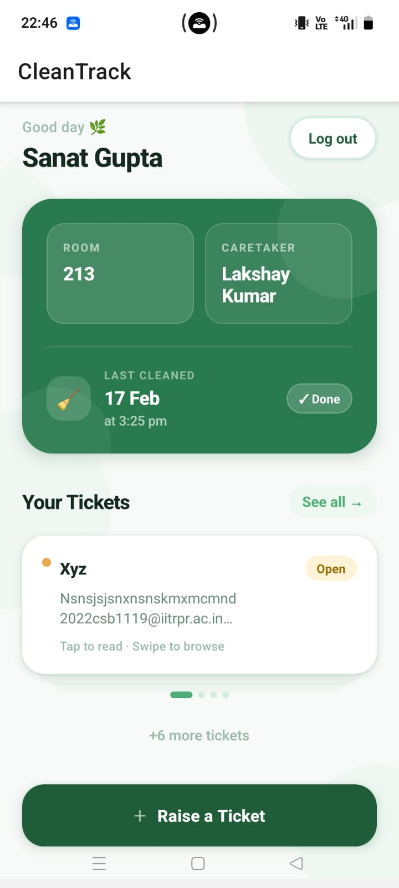
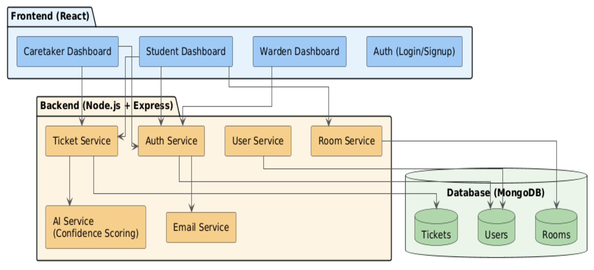
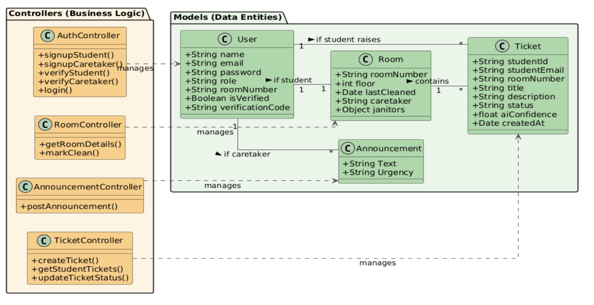

# CleanTrack — Hostel Sanitation Ticket Management (Mobile + Backend)

<p align="center">
  
</p>

## Overview

CleanTrack is a full-stack mobile application designed to streamline hostel sanitation management. Students can report cleanliness issues, track tickets, and view room details, while caretakers can manage and respond to these tickets. In process - not yet finished. 

This project consists of:

* **React Native (Expo)** mobile app
* **Node.js + Express** backend
* **MongoDB Atlas** database

---

## Features Implemented (So Far)

### Authentication

* User login (Student / Caretaker)
* JWT-based authentication
* Persistent login using AsyncStorage

### Student Dashboard

* View room details
* View caretaker information
* View last cleaned timestamp

### Ticket System

* Fetch student tickets
* Raise new sanitation tickets
* Instant UI update after ticket creation

### State-driven Navigation

* Automatic redirect after login
* Role-based routing (Student / Caretaker(yet to be made))
* Logout with state reset

---

## Architecture

```
Mobile App (React Native)
        ↓
   REST API (Axios)
        ↓
Backend (Node.js + Express)
        ↓
MongoDB Atlas
```
<p align="center">
  
</p>
---

## Tech Stack

### Frontend (Mobile)

* React Native (Expo)
* React Navigation
* AsyncStorage
* Axios

### Backend

* Node.js
* Express.js
* JWT Authentication
* Mongoose

### Database

* MongoDB Atlas

---
<p align="center">
  
</p>
## Project Structure

```
Hostel-Sanitation-Ticket-Management/
│
├── backend/
│   ├── config/
│   ├── routes/
│   ├── models/
│   ├── middleware/
│   └── index.js│
└── frontend/ (original web app)
Cleantrack/
│   ├── src/
│   │   ├── screens/
│   │   ├── navigation/
│   │   ├── services/
│   │   └── utils/
│   └── App.js

```
To be clubbed together during deployment.
---

## Setup Instructions

---

```bash
git clone https://github.com/KayG2310/Hostel-Sanitation-Ticket-Management.git
cd backend
```

---


#### Create `.env` file:

```env
PORT=3000
MONGO_URI=your_mongodb_connection_string
JWT_SECRET=your_secret
FRONTEND_URL=http://localhost:5173
```
---

### 3. Mobile App Setup (Expo)

```bash
cd Cleantrack
npm install
```

#### Start backend and app:

```bash
npm start
npx expo start # in CleanTrack repo
```

---

### Network Configuration (IMPORTANT)

Since the mobile app runs on a device:

* Connect phone & laptop to same network (or hotspot)
* Find your IP:

```bash
ifconfig
```

* Update API base URL in `src/services/api.js`:

```js
baseURL: "http://YOUR_IP:3000"
```

---

## API Endpoints Used

| Method | Endpoint                         | Description       |
| ------ | -------------------------------- | ----------------- |
| POST   | `/api/auth/login`                | User login        |
| GET    | `/api/student/dashboard-student` | Student dashboard |
| GET    | `/api/tickets/student/:email`    | Fetch tickets     |
| POST   | `/api/tickets/create`            | Create ticket     |

---

## Authentication Flow

1. User logs in
2. Backend validates credentials
3. JWT token returned
4. Token stored in AsyncStorage - To maintain user session unless explicitly logged out
5. App state (`isLoggedIn`) updated
6. Navigator switches screen automatically

---

## Navigation Logic

```text
Login Success → setIsLoggedIn(true)
→ AppNavigator re-renders
→ Redirect based on role
```
---

## Common Issues Faced & Fixes

### Network Error (Axios)

* Cause: Wrong IP / backend not exposed
* Fix:

  * Use correct IP
  * Make sure mobile phone and PC are connected to the same network. If IP beginning with `192.XX` is not visible, use mobile hotspot.

```js
app.listen(PORT, "0.0.0.0")
```
---

## Key Concepts Learned

* REST API communication
* JWT-based authentication
* State-driven navigation
* Mobile ↔ backend networking
* React Native UI vs Web UI differences
* Async storage handling

--- 
## Authors
Kamakshi Gupta <br>
Diya Bhatnagar
